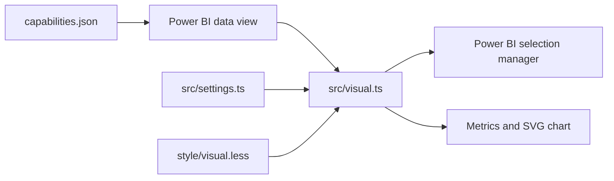

# Fancy Line Graph Slicer

A responsive Power BI custom visual for exploring a time-series measure with two draggable comparison handles.

## Features

- Responsive line and area chart
- Draggable Start and End handles
- Native Power BI cross-selection for the selected interval
- Start, End, percentage Change, Selected Total, and current-value metrics
- Positive and negative values with a zero baseline
- Responsive x-axis and balanced y-axis labels
- Configurable colors, labels, typography, number formats, date formats, line styling, handles, corner radius, and border
- Persistent handle positions across resizing, zooming, and formatting updates

## Data Roles

| Role | Type | Description |
| --- | --- | --- |
| Category Data | Grouping | Ordered category, normally a date |
| Measure Data | Measure | Numeric value plotted on the line graph |

## Build

### Prerequisites

- Node.js 18 or later
- npm
- Power BI Visuals CLI (`powerbi-visuals-tools`), installed locally by `npm install`

### Commands

```powershell
npm install
npm run lint
npx pbiviz package
```

`npx pbiviz package` uses the repository's pinned CLI version and creates an importable `.pbiviz` file in `dist/`. After `npm install`, `npm run package` is an equivalent alias.

For local development with the Power BI developer visual:

```powershell
npx pbiviz start
```

## Source Layout

```text
Fancy Line Graph Slicer/
|-- assets/
|   `-- icon.png
|-- src/
|   |-- settings.ts
|   `-- visual.ts
|-- style/
|   `-- visual.less
|-- capabilities.json
|-- eslint.config.mjs
|-- package-lock.json
|-- package.json
|-- pbiviz.json
`-- tsconfig.json
```

- `src/visual.ts` implements rendering, interaction, selection, formatting application, and responsive behavior.
- `src/settings.ts` defines the Power BI format-pane cards and controls.
- `style/visual.less` defines layout, chart styling, responsive states, and the directional comparison treatment.
- `capabilities.json` declares data roles, mappings, formatting properties, and selection support.
- `pbiviz.json` contains the visual identity, API version, source references, and package metadata.
- `package.json`, `package-lock.json`, `tsconfig.json`, and `eslint.config.mjs` define the reproducible toolchain.

## Architecture



Power BI supplies a categorical data view. The visual converts valid category/measure pairs into chart points, restores the selected range by stable category keys, applies format-pane settings, renders the metric strip and SVG chart, and reports range selections through the native selection manager.

## Packaging Notes

- Keep property names synchronized between `src/settings.ts` and `capabilities.json`.
- Increment both version fields in `pbiviz.json` for distributable releases.
- Do not commit `dist/`, `.tmp/`, `node_modules/`, certificates, or local editor settings.

## License

MIT. See the repository-level [LICENSE](../LICENSE).
